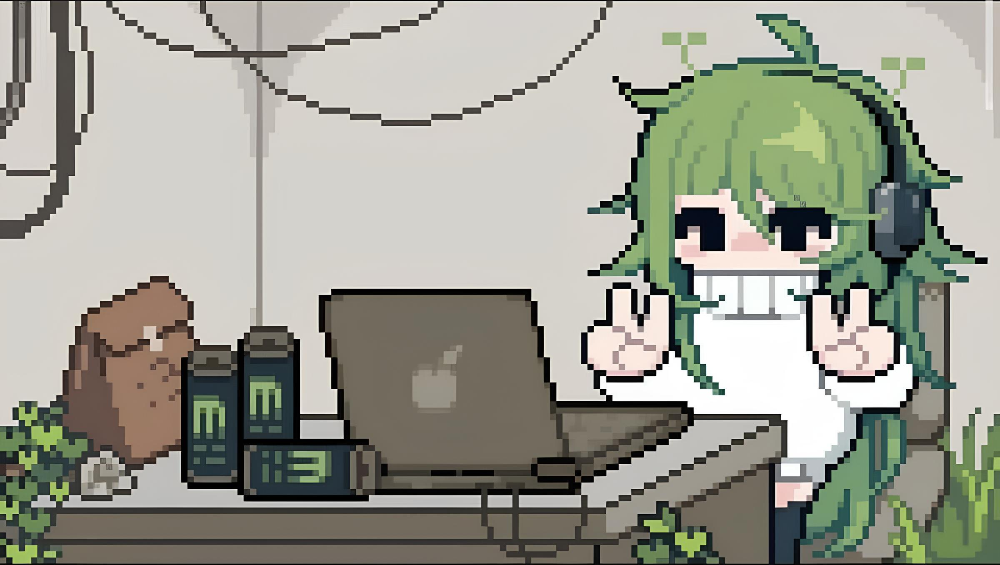

<!--banner-->
<div>



</div>

---

<br>

<div align="center">  

[](https://git.io/typing-svg)

</div>

<!-- Apresentação -->

Eu sou Daniel — estudante de Ciência da Computação e desenvolvedor. Gosto de colocar ideias em prática, criar projetos e entender cada vez mais o que acontece por trás do código. Não gosto muito de ficar apenas na teoria, então sempre que posso tento transformar o que estou estudando em alguma coisa que possa construir e testar.

Ao longo desse caminho, venho explorando diferentes linguagens, ferramentas e áreas do desenvolvimento. Gosto de experimentar, quebrar algumas coisas no processo e descobrir como fazer melhor da próxima vez... (｡◕‿◕｡)  

<br>

```text
// Atualmente, estou aprofundando meus conhecimentos em programação
// e desenvolvimento de software, sempre buscando entender melhor
// como as coisas funcionam por trás do código.
//
// Sou bastante curioso, estou sempre construindo, testando ideias
// e buscando evoluir. Gosto de aprender fazendo, mesmo que no
// processo algumas coisas acabem quebrando... (￣▽￣*)ゞ
```
<br>

<!-- Skills -->

## 🛠️ Minhas Ferramentas


### Meu Ambiente


### Linguagens


### Frameworks


### Ferramentas


<br>

<!-- EStatísticas  -->
## 📊 Estatísticas

<div align="center" style="overflow:hidden">
  <table width="100%" border="0" style="border-collapse:collapse">
    <tr>
      <td align="center" style="border:none;padding:0 8px">
        
      </td>
      <td align="center" style="border:none;padding:0 8px;">
        
      </td>
    </tr>
  </table>
</div>

<br>
<br>

<!-- Pacman -->
<picture>
    <source media="(prefers-color-scheme: dark)" srcset="https://raw.githubusercontent.com/Danyel-xp/Danyel-xp/output/pacman-contribution-graph-dark.svg">
  <source media="(prefers-color-scheme: light)" srcset="https://raw.githubusercontent.com/Danyel-xp/Danyel-xp/output/pacman-contribution-graph.svg">
  
</picture>

---

<!-- Footer -->

>🧠 *"Construa, quebre, aprenda e evolua. Esse é o ciclo de um verdadeiro desenvolvedor."* — Daniel
<br>
<br>

<p align="center">
  <a href="mailto: danyellrodrigues023@gmail.com" ></a> 
    <a href="https://www.linkedin.com/in/danyelrodrigues/" ></a>
  <a href="https://github.com/Danyel-xp"></a>
  <a href="https://wa.me/5586981888397" target = "_blank"></a>
  
</p>
